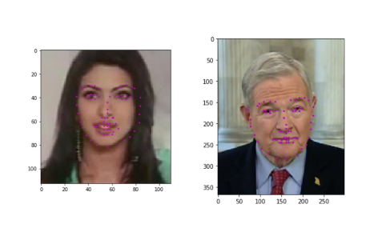
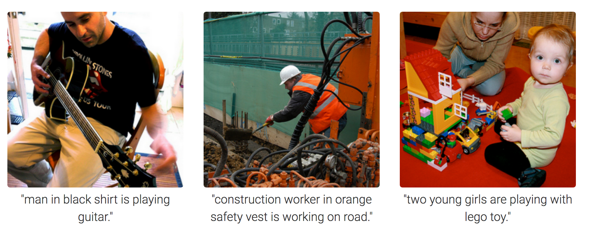
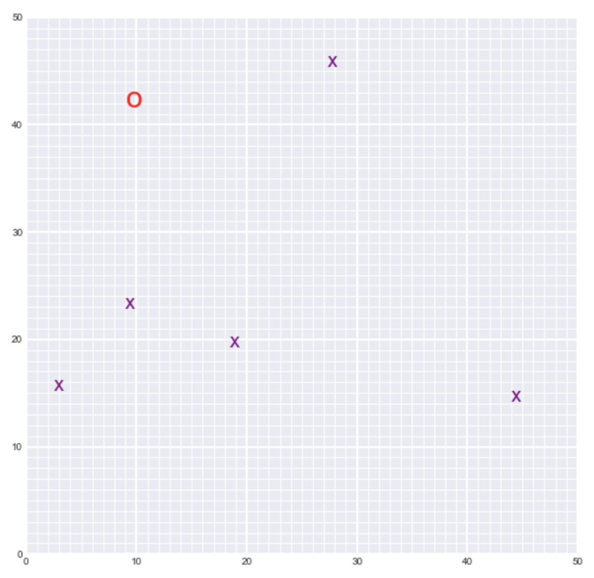

# Computer Vision Nanodegree

This repository contains the projects done as part of Udacity's Computer Vision Nanodegree

## Project 1:
In this project I have combined my knowledge of computer vision techniques and deep learning architectures to build a facial keypoint detection system that takes in any image with faces, and predicts the location of 68 distinguishing keypoints on each face.

## Project 2:
In this project I have created a neural network architecture that consists of EncoderCNN and DecoderRNN to automatically generate captions from images.

## Project 3:
In this project, I have implement SLAM (Simultaneous Localization and Mapping) for a 2 dimensional world! I have combined what I know about robot sensor measurements and movement to create a map of an environment from only sensor and motion data gathered by a robot, over time. SLAM gives a way to track the location of a robot in the world in real-time and identify the locations of landmarks such as buildings, trees, rocks, and other world features.

